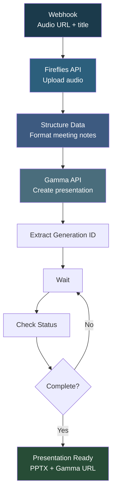

# Fireflies to Gemini to Gamma

## Overview

This automation **turns meeting recordings into professional presentations automatically**. It uploads audio to Fireflies.ai for transcription, structures the meeting notes (summary, key topics, action items, transcript highlights), and sends them to Gamma.app to generate a polished presentation deck. The result is a ready-to-share PPTX file created from your meeting content without any manual work.

## How It Works

```
Webhook (audio URL) -> Fireflies Upload -> Structure Meeting Data -> Gamma Create Presentation -> Poll Until Complete
```

### Workflow Diagram



## Integrations

- **Fireflies.ai** - Meeting audio transcription and analysis
- **Gamma.app** - AI-powered presentation generation

## Setup

1. Import `Fireflies_Gemini_Gamma.json` into your n8n instance.
2. Update the Fireflies API key and Gamma API credentials.
3. Activate the workflow and send a POST with audio URL and meeting title.
